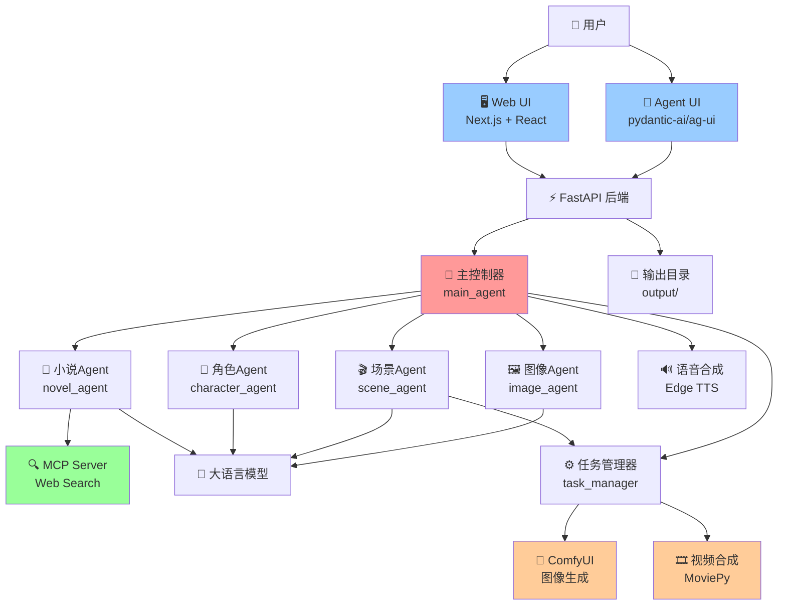
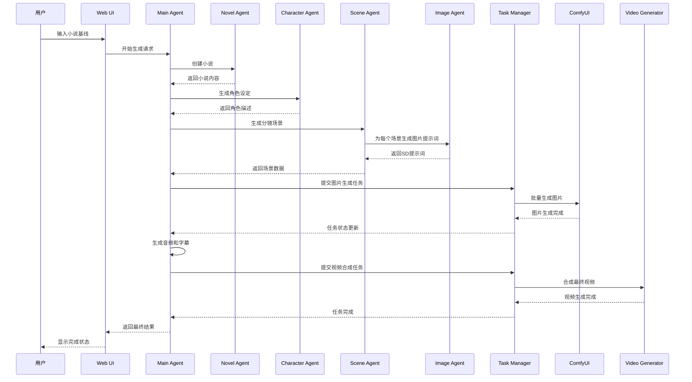
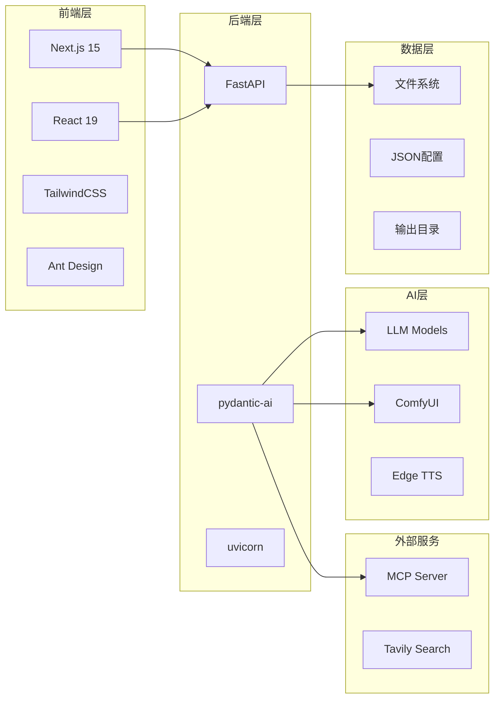

# 视频生成代理系统 (Video Generation Agent System)

[](https://www.python.org/downloads/)
[](https://fastapi.tiangolo.com/)
[](https://nextjs.org/)
[](LICENSE)

一个基于多Agent架构的AI视频生成系统，能够自动将小说文本转换为完整的短视频作品。

## 🚀 快速开始

### 环境要求

- Python 3.10+
- Node.js 18+
- ComfyUI 服务器
- 支持的操作系统：macOS, Linux, Windows

### 安装

1. **克隆项目**
```bash
git clone https://github.com/tohsaka888/video-generate-agent.git
cd video-generate-agent
```

2. **安装Python依赖**
```bash
# 使用 uv (推荐)
pip install uv
uv sync

# 或使用 pip
pip install -r requirements.txt
```

3. **安装Web前端依赖**
```bash
cd web
pnpm install
# 或 npm install
```

4. **配置环境变量**
```bash
cp .env.example .env
# 编辑 .env 文件，配置必要的API密钥
```

环境变量说明：
- `COMFYUI_BASE_URL`: ComfyUI服务器地址
- `TAVILY_API`: Tavily搜索API密钥
- `OPENAI_API_KEY`: OpenAI API密钥（可选）
- `FONT_PATH`: 字体文件路径

### 运行

1. **启动后端服务**
```bash
# 开发模式
python main.py

# 或使用 uvicorn
uvicorn main:app --host 0.0.0.0 --port 8000 --reload
```

2. **启动前端服务**
```bash
cd web
pnpm dev
# 或 npm run dev
```

3. **访问应用**
- Web界面: http://localhost:3000
- API文档: http://localhost:8000/docs
- Agent UI: http://localhost:8000/agent

## 📋 使用说明

### 基本流程

1. **访问Web界面** - 打开 http://localhost:3000
2. **输入小说基线** - 在输入框中描述您想要的小说主题或大纲
3. **开始生成** - 系统将自动执行以下步骤：
   - 🔸 小说创作 - AI根据基线创作完整小说
   - 🔸 角色设定 - 生成小说中的角色描述
   - 🔸 场景分镜 - 将小说分解为视频场景
   - 🔸 图片生成 - 为每个场景生成对应图像
   - 🔸 音频合成 - 生成旁白和背景音
   - 🔸 视频合成 - 合成最终视频作品

### API接口

- `POST /agent` - Agent交互接口
- `GET /api/output-tree` - 获取输出文件树
- `GET /api/file-tree` - 文件树状态（兼容接口）

## 🏗️ 架构设计

### 系统架构图



### 多Agent交互流程



### 技术栈组件



## 📁 项目结构

```
video-generate-agent/
├── 📄 main.py                 # FastAPI主应用
├── 📄 pyproject.toml          # 项目配置
├── 📁 agents/                 # AI Agent模块
│   ├── 📄 main_agent.py       # 主控制器Agent
│   ├── 📄 novel_agent.py      # 小说创作Agent
│   ├── 📄 character_agent.py  # 角色设定Agent
│   ├── 📄 scene_agent.py      # 场景分镜Agent
│   └── 📄 image_agent.py      # 图像生成Agent
├── 📁 mcp_servers/            # MCP服务器
│   └── 📄 web_search.py       # 网络搜索工具
├── 📁 utils/                  # 工具模块
│   ├── 📄 llm.py             # 大语言模型接口
│   ├── 📄 comfyui.py         # ComfyUI接口
│   ├── 📄 edge_tts.py        # 语音合成
│   ├── 📄 video.py           # 视频处理
│   ├── 📄 task_manager.py    # 任务管理器
│   └── 📄 config.py          # 配置管理
├── 📁 web/                   # Web前端
│   ├── 📄 package.json       # 前端依赖
│   ├── 📁 app/               # Next.js应用
│   └── 📁 components/        # React组件
├── 📁 assets/                # 资源文件
│   ├── 📁 bgm/              # 背景音乐
│   ├── 📁 font/             # 字体文件
│   ├── 📁 voice/            # 语音模板
│   └── 📁 workflow/         # ComfyUI工作流
└── 📁 output/               # 生成输出
    ├── 📁 images/           # 生成的图片
    ├── 📁 audio/            # 生成的音频
    ├── 📁 scripts/          # 分镜脚本
    ├── 📁 subtitles/        # 字幕文件
    └── 📄 final_video.mp4   # 最终视频
```

## 🔧 配置说明

### ComfyUI配置

确保ComfyUI服务器运行在指定端口，并配置工作流文件：

```json
{
  "workflow": "assets/workflow/config.json"
}
```

### 字体配置

系统支持自定义字体，默认使用：
- `assets/font/MapleMono-NF-CN-Regular.ttf`

### 背景音乐

将背景音乐文件放置在 `assets/bgm/` 目录下，支持格式：
- MP3, WAV, OGG, M4A

## 🚧 故障排除

### 常见问题

1. **ComfyUI连接失败**
   - 检查 `COMFYUI_BASE_URL` 环境变量
   - 确保ComfyUI服务器正常运行

2. **图片生成失败**
   - 检查ComfyUI工作流配置
   - 验证模型文件是否正确加载

3. **音频生成问题**
   - 确认Edge TTS服务可用
   - 检查网络连接状态

4. **视频合成错误**
   - 确保所有输入文件存在
   - 检查输出目录权限

### 日志查看

- 后端日志：控制台输出
- 前端日志：浏览器开发者工具
- 任务状态：通过API接口查看

## 🤝 贡献指南

1. Fork 项目
2. 创建特性分支 (`git checkout -b feature/AmazingFeature`)
3. 提交更改 (`git commit -m 'Add some AmazingFeature'`)
4. 推送到分支 (`git push origin feature/AmazingFeature`)
5. 创建 Pull Request

## 📄 许可证

本项目基于 MIT 许可证开源 - 查看 [LICENSE](LICENSE) 文件了解详情。

## 🔗 相关链接

- [FastAPI 文档](https://fastapi.tiangolo.com/)
- [pydantic-ai 文档](https://ai.pydantic.dev/)
- [ComfyUI 项目](https://github.com/comfyanonymous/ComfyUI)
- [Next.js 文档](https://nextjs.org/docs)

---

⭐ 如果这个项目对您有帮助，请给我们一个星标！
