# Video Generation Agent System

[](https://www.python.org/downloads/)
[](https://fastapi.tiangolo.com/)
[](https://nextjs.org/)
[](LICENSE)

An AI-powered video generation system based on multi-agent architecture that automatically converts novel text into complete short video works.

## 🚀 Quick Start

### Requirements

- Python 3.10+
- Node.js 18+
- ComfyUI Server
- Supported OS: macOS, Linux, Windows

### Installation

1. **Clone the repository**
```bash
git clone https://github.com/tohsaka888/video-generate-agent.git
cd video-generate-agent
```

2. **Install Python dependencies**
```bash
# Using uv (recommended)
pip install uv
uv sync

# Or using pip
pip install -r requirements.txt
```

3. **Install web frontend dependencies**
```bash
cd web
pnpm install
# or npm install
```

4. **Configure environment variables**
```bash
cp .env.example .env
# Edit .env file and configure necessary API keys
```

Environment variables explanation:
- `COMFYUI_BASE_URL`: ComfyUI server address
- `TAVILY_API`: Tavily search API key
- `OPENAI_API_KEY`: OpenAI API key (optional)
- `FONT_PATH`: Font file path

### Running

1. **Start backend service**
```bash
# Development mode
python main.py

# Or using uvicorn
uvicorn main:app --host 0.0.0.0 --port 8000 --reload
```

2. **Start frontend service**
```bash
cd web
pnpm dev
# or npm run dev
```

3. **Access the application**
- Web UI: http://localhost:3000
- API Documentation: http://localhost:8000/docs
- Agent UI: http://localhost:8000/agent

## 📋 Usage Guide

### Basic Workflow

1. **Access Web Interface** - Open http://localhost:3000
2. **Input Novel Baseline** - Describe your desired novel theme or outline in the input box
3. **Start Generation** - The system will automatically execute the following steps:
   - 🔸 Novel Creation - AI creates complete novel based on baseline
   - 🔸 Character Settings - Generate character descriptions from the novel
   - 🔸 Scene Storyboard - Break down novel into video scenes
   - 🔸 Image Generation - Generate corresponding images for each scene
   - 🔸 Audio Synthesis - Generate narration and background audio
   - 🔸 Video Composition - Compose final video work

### API Endpoints

- `POST /agent` - Agent interaction interface
- `GET /api/output-tree` - Get output file tree
- `GET /api/file-tree` - File tree status (compatibility interface)

## 🏗️ Architecture Design

### System Architecture

```mermaid
graph TB
    User[👤 User] --> WebUI[🖥️ Web UI<br/>Next.js + React]
    User --> AgentUI[🤖 Agent UI<br/>pydantic-ai/ag-ui]
    
    WebUI --> FastAPI[⚡ FastAPI Backend]
    AgentUI --> FastAPI
    
    FastAPI --> MainAgent[🎯 Main Controller<br/>main_agent]
    
    MainAgent --> NovelAgent[📖 Novel Agent<br/>novel_agent]
    MainAgent --> CharacterAgent[👥 Character Agent<br/>character_agent]
    MainAgent --> SceneAgent[🎬 Scene Agent<br/>scene_agent]
    MainAgent --> ImageAgent[🖼️ Image Agent<br/>image_agent]
    
    NovelAgent --> MCPServer[🔍 MCP Server<br/>Web Search]
    NovelAgent --> LLM[🧠 Large Language Model]
    CharacterAgent --> LLM
    SceneAgent --> LLM
    ImageAgent --> LLM
    
    SceneAgent --> TaskManager[⚙️ Task Manager<br/>task_manager]
    MainAgent --> TaskManager
    
    TaskManager --> ComfyUI[🎨 ComfyUI<br/>Image Generation]
    TaskManager --> VideoGen[🎞️ Video Composition<br/>MoviePy]
    
    MainAgent --> TTS[🔊 Text to Speech<br/>Edge TTS]
    
    FastAPI --> OutputTree[📁 Output Directory<br/>output/]
    
    style MainAgent fill:#ff9999
    style WebUI fill:#99ccff
    style AgentUI fill:#99ccff
    style MCPServer fill:#99ff99
    style ComfyUI fill:#ffcc99
    style VideoGen fill:#ffcc99
```



### Multi-Agent Interaction Flow


### Technology Stack Components


## 📁 Project Structure

```
video-generate-agent/
├── 📄 main.py                 # FastAPI main application
├── 📄 pyproject.toml          # Project configuration
├── 📁 agents/                 # AI Agent modules
│   ├── 📄 main_agent.py       # Main controller agent
│   ├── 📄 novel_agent.py      # Novel creation agent
│   ├── 📄 character_agent.py  # Character setting agent
│   ├── 📄 scene_agent.py      # Scene storyboard agent
│   └── 📄 image_agent.py      # Image generation agent
├── 📁 mcp_servers/            # MCP servers
│   └── 📄 web_search.py       # Web search tools
├── 📁 utils/                  # Utility modules
│   ├── 📄 llm.py             # LLM interface
│   ├── 📄 comfyui.py         # ComfyUI interface
│   ├── 📄 edge_tts.py        # Text-to-speech
│   ├── 📄 video.py           # Video processing
│   ├── 📄 task_manager.py    # Task manager
│   └── 📄 config.py          # Configuration management
├── 📁 web/                   # Web frontend
│   ├── 📄 package.json       # Frontend dependencies
│   ├── 📁 app/               # Next.js application
│   └── 📁 components/        # React components
├── 📁 assets/                # Asset files
│   ├── 📁 bgm/              # Background music
│   ├── 📁 font/             # Font files
│   ├── 📁 voice/            # Voice templates
│   └── 📁 workflow/         # ComfyUI workflows
└── 📁 output/               # Generated output
    ├── 📁 images/           # Generated images
    ├── 📁 audio/            # Generated audio
    ├── 📁 scripts/          # Scene scripts
    ├── 📁 subtitles/        # Subtitle files
    └── 📄 final_video.mp4   # Final video
```

## 🔧 Configuration

### ComfyUI Configuration

Ensure ComfyUI server is running on the specified port and configure the workflow file:

```json
{
  "workflow": "assets/workflow/config.json"
}
```

### Font Configuration

The system supports custom fonts, default is:
- `assets/font/MapleMono-NF-CN-Regular.ttf`

### Background Music

Place background music files in the `assets/bgm/` directory, supported formats:
- MP3, WAV, OGG, M4A

## 🚧 Troubleshooting

### Common Issues

1. **ComfyUI connection failed**
   - Check `COMFYUI_BASE_URL` environment variable
   - Ensure ComfyUI server is running properly

2. **Image generation failed**
   - Check ComfyUI workflow configuration
   - Verify model files are loaded correctly

3. **Audio generation issues**
   - Confirm Edge TTS service is available
   - Check network connection status

4. **Video composition errors**
   - Ensure all input files exist
   - Check output directory permissions

### Log Viewing

- Backend logs: Console output
- Frontend logs: Browser developer tools
- Task status: View through API endpoints

## 🤝 Contributing

1. Fork the project
2. Create a feature branch (`git checkout -b feature/AmazingFeature`)
3. Commit your changes (`git commit -m 'Add some AmazingFeature'`)
4. Push to the branch (`git push origin feature/AmazingFeature`)
5. Create a Pull Request

## 📄 License

This project is open sourced under the MIT License - see the [LICENSE](LICENSE) file for details.

## 🔗 Related Links

- [FastAPI Documentation](https://fastapi.tiangolo.com/)
- [pydantic-ai Documentation](https://ai.pydantic.dev/)
- [ComfyUI Project](https://github.com/comfyanonymous/ComfyUI)
- [Next.js Documentation](https://nextjs.org/docs)

---

⭐ If this project helps you, please give us a star!
